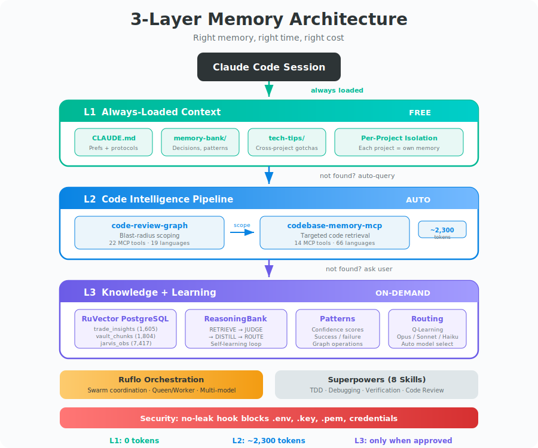
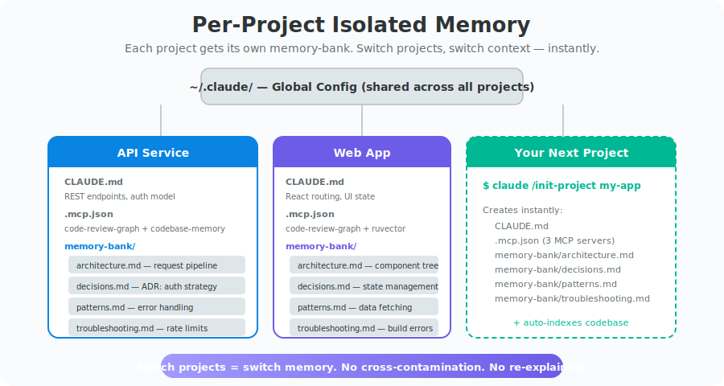

<!-- claude-memory-stack v1.0.0 | Rajat Tanwar (@rajat1021) -->

<h1 align="center">claude-memory-stack</h1>

<p align="center">
  <strong>Stop Claude from forgetting. Ship faster with fewer tokens.</strong>
</p>

<p align="center">
  A portable, deployable 3-layer memory architecture for Claude Code that<br>
  reduces token consumption by ~81% and makes your AI assistant learn from every session.
</p>

<p align="center">
  <a href="LICENSE"></a>
  <a href="https://claude.ai/code"></a>
  <a href="#"></a>
  <a href="#"></a>
  <a href="#"></a>
</p>

---

## The Problem

Claude Code forgets everything between sessions. Every new conversation starts from zero — re-reading files, re-discovering architecture, re-learning your preferences. You burn tokens repeating context that should already be known.

Vector databases alone don't fix this. The problem isn't storage — it's **retrieval architecture**. Dumping embeddings into a single store creates noise, retrieval latency, and context window bloat.

**What you need is a tiered system that loads the right memory at the right time, at the right cost.**

---

## The Solution

<p align="center"><strong>3 layers. Each serves a different purpose. Each has a different cost.</strong></p>

<p align="center">
  
</p>

<details>
<summary><strong>ASCII version (for terminals)</strong></summary>
<br>

```
┌──────────────────────────────────────────────────────────────────┐
│                       Claude Code Session                        │
│                                                                  │
│  ┌────────────────────────────────────────────────────────────┐  │
│  │  L1: Always-Loaded Context              COST: FREE        │  │
│  │  CLAUDE.md + memory-bank/*.md + tech-tips/*.md             │  │
│  │  Preferences, decisions, patterns, strategies              │  │
│  └────────────────────────────────────────────────────────────┘  │
│                              │                                    │
│                   falls through if not found                      │
│                              ▼                                    │
│  ┌────────────────────────────────────────────────────────────┐  │
│  │  L2: Code Intelligence Pipeline         COST: AUTO        │  │
│  │  code-review-graph ──▶ codebase-memory-mcp                 │  │
│  │  Blast-radius scoping → targeted code retrieval            │  │
│  └────────────────────────────────────────────────────────────┘  │
│                              │                                    │
│                   falls through if not found                      │
│                              ▼                                    │
│  ┌────────────────────────────────────────────────────────────┐  │
│  │  L3: Knowledge + Learning               COST: ON-DEMAND   │  │
│  │  RuVector PostgreSQL with ReasoningBank                    │  │
│  │  Vectors + patterns + learning + graph ops                 │  │
│  └────────────────────────────────────────────────────────────┘  │
│                                                                  │
│  ┌───────────────────────┐  ┌─────────────────────────────────┐ │
│  │  Ruflo Orchestration  │  │  Superpowers (8 skills)          │ │
│  │  Swarms + Q-Learning  │  │  TDD, Debug, Review, Verify     │ │
│  └───────────────────────┘  └─────────────────────────────────┘ │
│                                                                  │
│  ┌────────────────────────────────────────────────────────────┐  │
│  │  Security: no-leak hook blocks .env, .key, .pem, secrets  │  │
│  └────────────────────────────────────────────────────────────┘  │
└──────────────────────────────────────────────────────────────────┘
```

</details>

---

## Impact

<p align="center"><strong>Measured on real-world coding sessions with 25 turns.</strong></p>

| Metric | Without Stack | With Stack | Improvement |
|:-------|---:|---:|:---:|
| Tokens per session | ~380,000 | ~72,000 | **-81%** |
| System prompt per turn | 22,000 | 16,500 | **-25%** |
| Code exploration task | 65,000 | 2,300 | **-96%** |
| Memory queries per session | 30 | 0–8 | **-73%** |
| Effective sessions per $ budget | 1x | ~5x | **+400%** |
| Bug-related rework | ~40% | ~10% | **-75%** |

> **L1** eliminates repeated context. **L2** replaces multi-round grep with single graph queries. **L3** surfaces historical knowledge only when needed, instead of stuffing the prompt with everything.

---

## Quick Start

### Prerequisites

- macOS or Linux
- Node.js 20+
- Docker Desktop (running)
- Claude Code CLI (`npm install -g @anthropic-ai/claude-code`)
- jq (`brew install jq`)

### Install

```bash
git clone https://github.com/rajat1021/claude-memory-stack.git
cd claude-memory-stack
./install.sh
```

### Verify

```bash
./verify.sh
```

### Set GitHub Token (optional)

```bash
echo 'export GITHUB_TOKEN="ghp_your_token"' >> ~/.zshenv
source ~/.zshenv
./install.sh  # re-run to inject token
```

<details>
<summary><strong>What the installer does</strong></summary>
<br>

1. Checks prerequisites (Node.js 20+, Docker, Claude CLI, jq)
2. Installs MCP servers (codebase-memory-mcp, code-review-graph, ruvector)
3. Starts RuVector PostgreSQL container (port 5433, auto-restart on boot)
4. Configures Docker Desktop to start on login
5. Installs Ruflo orchestration
6. Backs up existing config (`~/.claude/CLAUDE.md`, `settings.json`, `.mcp.json`)
7. Deploys new config with trimmed system prompt
8. Deploys hooks (2 instead of 7), skills, commands, tech-tips
9. Installs Superpowers plugin
10. Writes install marker and runs verification

**Idempotent** — safe to run multiple times.

</details>

---

## Architecture Deep Dive

<details>
<summary><strong>Layer 1: Always-Loaded Context</strong></summary>
<br>

Files in `~/.claude/CLAUDE.md` and `~/.claude/memory-bank/*.md` are loaded into every session's system prompt automatically. This is where you store:

- Coding style preferences and conventions
- Project-specific protocols and state
- Architecture Decision Records (ADRs)
- Tech-tips (cross-project gotchas)

**Cost:** Part of the system prompt. No queries. No latency. No cost.

</details>

<details>
<summary><strong>Layer 2: Code Intelligence Pipeline</strong></summary>
<br>

Two MCP servers chained for maximum token efficiency:

**Stage 1 — code-review-graph (scoping)**
- Blast-radius analysis: "this change affects 4 functions in 3 files"
- Risk scoring: "high: payment_handler, low: logger"
- 22 MCP tools, 19 languages

**Stage 2 — codebase-memory-mcp (precision retrieval)**
- `get_code_snippet()`: exact function code (~200 tokens vs ~5,000 for full file)
- `trace_call_path()`: who calls what, depth-controlled
- 14 MCP tools, 66 languages

**Together:** Know WHAT to look at, then get ONLY that code.

**Cost:** 1 MCP call (~200–500 tokens) instead of 10+ grep/read cycles (~20,000–65,000 tokens).

</details>

<details>
<summary><strong>Layer 3: Knowledge + Learning</strong></summary>
<br>

RuVector PostgreSQL — replaces both pgvector (dumb storage) and memorygraph (separate knowledge graph) with one intelligent system:

| Feature | What It Does |
|---------|-------------|
| **Vector search** | HNSW-indexed similarity on insights, note_chunks, observations |
| **ReasoningBank** | RETRIEVE → JUDGE → DISTILL → ROUTE learning loop |
| **Pattern tracking** | Confidence scores, success/failure counts per insight |
| **Graph operations** | Relationships between insights — replaces memorygraph |
| **Agent routing** | Auto-route tasks to optimal model via Q-Learning |

**Cost:** Only queried when user approves — except for keyword triggers ("history", "insights", "patterns").

</details>

<details>
<summary><strong>Memory Retrieval Protocol</strong></summary>
<br>

```
L1 (check first, free) → L2 (auto for code) → L3 (ask user first)
```

| Layer | Trigger | Cost |
|-------|---------|:----:|
| **L1** | Always loaded — check first | Free |
| **L2** | Auto-fires on code questions | Only when relevant |
| **L3** | Asks user before querying | Only when approved |

**L3 Exception:** If the user says "history", "what happened last time", "insights", or "patterns" — query L3 directly without asking.

</details>

<details>
<summary><strong>Orchestration: Ruflo</strong></summary>
<br>

- **Swarm coordination** — Queen/Worker hierarchy for parallel work
- **Q-Learning task routing** — right model for right task (Opus for hard, Haiku for simple)
- **ReasoningBank** — self-learning from every session
- **Multi-model selection** — 30–50% token savings via intelligent routing

</details>

<details>
<summary><strong>Discipline: Superpowers (8 skills)</strong></summary>
<br>

| Skill | What It Enforces |
|-------|-----------------|
| **Brainstorming** | Explore intent before implementation |
| **Writing Plans** | Structured specs before code |
| **TDD** | No production code without failing test first |
| **Systematic Debugging** | Root cause before fix attempts |
| **Verification** | Run commands + confirm output before claiming done |
| **Code Review (give)** | Verify work meets requirements |
| **Code Review (receive)** | Verify feedback technically before implementing |
| **Git Worktrees** | Isolated feature work with safety checks |

</details>

---

## Components

| Component | Type | Source | Role |
|:----------|:-----|:-------|:-----|
| **codebase-memory-mcp** | MCP server | [DeusData/codebase-memory-mcp](https://github.com/DeusData/codebase-memory-mcp) | L2 — code graph, 66 languages, sub-ms queries |
| **code-review-graph** | MCP server | [tirth8205/code-review-graph](https://github.com/tirth8205/code-review-graph) | L2 — blast-radius scoping, risk scoring |
| **ruvector** | MCP + PostgreSQL | [ruvnet/ruflo](https://github.com/ruvnet/ruflo) | L3 — vectors, learning, graph, routing |
| **github MCP** | MCP server | [@anthropic-ai/github-mcp-server](https://github.com/anthropics/github-mcp-server) | GitHub integration — PRs, issues, CI |
| **ruflo** | Orchestration | [ruvnet/ruflo](https://github.com/ruvnet/ruflo) | Swarms, Q-Learning routing, ReasoningBank |
| **superpowers** | Plugin (8 skills) | [obra/superpowers](https://github.com/obra/superpowers) | TDD, debugging, verification, code review |
| **no-leak** | Hook | Custom | Blocks .env, .pem, .key, credentials |
| **auto-index** | Hook | Custom | Re-indexes codebase on session start |

---

## Per-Project Isolated Memory

Every project gets its own memory-bank. Switch projects, switch context — instantly. No cross-contamination.

<p align="center">
  
</p>

### Bootstrap a New Project

```bash
cd ~/my-new-project
claude /init-project my-project
```

Creates (copied from `~/.claude/templates/project/` with placeholders substituted):
```
my-project/
├── .mcp.json                              # codebase-memory + memory-graph + postgres
├── CLAUDE.md                              # Project prefs + @imports
└── .claude/
    └── memory-bank/
        ├── architecture/system-overview.md
        ├── decisions/README.md            # ADR log
        ├── patterns/coding-standards.md
        └── troubleshooting/known-issues.md
```

Placeholders substituted on init: `__PROJECT_NAME__`, `__CMS_CODEBASE_MEMORY_BIN__` (from `which codebase-memory-mcp`), `__CMS_DB_PASSWORD__` (from `$CMS_DB_PASSWORD` or default).

Then auto-runs `code-review-graph build` and `codebase-memory-mcp index`.

---

## Built-in Commands

| Command | Usage | What It Does |
|:--------|:------|:-------------|
| `/init-project` | `claude /init-project my-app` | Bootstrap 3-layer architecture for any project — creates CLAUDE.md, .mcp.json, memory-bank/, and indexes the codebase |
| `/tech-tip` | `claude /tech-tip python` | Capture a technology-specific gotcha to the shared tips library at `~/.claude/memory-bank/tech-tips/` |

### Hooks (auto-fire, no manual action)

| Hook | Fires On | What It Does |
|:-----|:---------|:-------------|
| **no-leak** | Every file read/write/edit/bash | Blocks access to `.env`, `.pem`, `.key`, `credentials.json` — prevents accidental secret exposure |
| **auto-index** | Session start | Re-indexes codebase graph if stale (>24h) — keeps L2 code intelligence fresh |

### Skills (invoked automatically when relevant)

| Skill | Trigger | Purpose |
|:------|:--------|:--------|
| **codebase-memory-exploring** | Code exploration questions | Guides Claude to use graph search instead of grep |
| **codebase-memory-tracing** | "Who calls this function?" | Traces call paths via graph instead of multi-round grep |
| **codebase-memory-quality** | Code quality questions | Dead code detection, complexity analysis via graph |
| **codebase-memory-reference** | MCP tool usage questions | Reference guide for graph query syntax |
| **defuddle** | URL content extraction | Clean markdown from web pages, saves tokens vs raw HTML |

---

## Migration

<details>
<summary><strong>From existing pgvector</strong></summary>
<br>

```bash
./migration/migrate-pgvector.sh
```

Migrates source tables into `insights`, `note_chunks`, and `observations` on RuVector PostgreSQL (port 5433). Configure source creds and table names via env vars — see `migration/migrate-pgvector.sh`.

</details>

<details>
<summary><strong>From memorygraph</strong></summary>
<br>

```bash
./migration/migrate-memorygraph.sh
```

Exports entities and relations from memorygraph SQLite databases into RuVector's patterns table.

</details>

<details>
<summary><strong>From vanilla Claude Code</strong></summary>
<br>

Just run `./install.sh`. It backs up your existing config before deploying. Originals saved as `*.bak.<timestamp>` in `~/.claude/`.

</details>

<details>
<summary><strong>Rollback</strong></summary>
<br>

```bash
./migration/rollback.sh   # Restore config backups
./uninstall.sh             # Full removal + Docker cleanup
```

</details>

---

## Configuration

### Global (all projects)

| File | Location | Purpose |
|:-----|:---------|:--------|
| `CLAUDE.md` | `~/.claude/CLAUDE.md` | Preferences, protocols, memory retrieval rules |
| `settings.json` | `~/.claude/settings.json` | Hooks, permissions, plugins |
| `.mcp.json` | `~/.claude/.mcp.json` | Global MCP servers (GitHub) |
| `memory-bank/` | `~/.claude/memory-bank/` | Tech-tips, shared knowledge |

### Per-project (overrides global)

| File | Location | Purpose |
|:-----|:---------|:--------|
| `CLAUDE.md` | `<project>/CLAUDE.md` | Project-specific instructions |
| `.mcp.json` | `<project>/.mcp.json` | Project MCP servers (code-review-graph, codebase-memory, ruvector) |
| `memory-bank/` | `<project>/.claude/memory-bank/` | Decisions, patterns, troubleshooting |

---

## Uninstall

```bash
./uninstall.sh
```

Stops Docker container, restores backed-up configs, removes hooks/skills/commands. Restart Claude Code after.

---

## Credits

<p align="center">
  Built by <strong><a href="https://github.com/rajat1021">Rajat Tanwar</a></strong>
</p>

<p align="center">
  Powered by:<br>
  <a href="https://github.com/DeusData/codebase-memory-mcp">codebase-memory-mcp</a> by DeusData &bull;
  <a href="https://github.com/tirth8205/code-review-graph">code-review-graph</a> by Tirth Patel<br>
  <a href="https://github.com/ruvnet/ruflo">ruflo</a> by Ruv &bull;
  <a href="https://github.com/obra/superpowers">superpowers</a> by Jesse Vincent<br>
  <a href="https://claude.ai/code">Claude Code</a> by Anthropic
</p>

---

<p align="center">
  <a href="LICENSE"></a>
</p>
